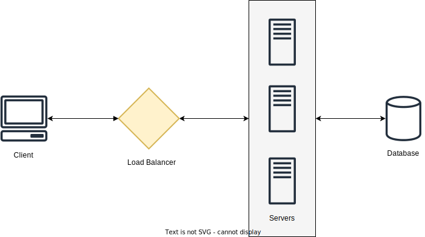

# System Design Template

Steps to take when solving a System Design Problem. Let's assume interviews take a total of 60 minutes.

## Step 1: Requirements Clarifications

Ask questions about the scope of the problem and clarify ambiguities. This part will also be important to guide our estimates later on.

Time Expected: 5 minutes

- Who is going to use it?
- How many users will use it?
- What will they be able to do?
- Should we focus on the backend or frontend?
- What are the inputs and outputs of the system?

## Step 2: Back-of-the-envelope Estimation

Time Expected: 5 minutes

Now, get the requirements and ask questions and make assumptions about the scale of the system.

- Scale/Traffic: how many new posts/tweets per day/sec? What is the read:write ratio?
- Storage: will users be able to post videos/images? How much data will we need to store all of the tweets?
- Bandwith: what is the incoming and outgoing data, given our traffic and data estimates? (10MB/s)
- Memory: how much memory will we need? Do we need to cache 20% of our requests and will need to store the results in memory?

Finish this step with a table containing the High-Level Estimates.

| Type                | Estimate |
| ------------------- | -------- |
| New Posts           | 200/s    |
| Incoming Data       | 100 KB/s |
| Outgoing Data       | 10 MB/s  |
| Storage for 5 years | 10 TB    |
| Memory for Cache    | 100 GB   |

## Step 3:  API Design

Define what is expected from the system in terms of APIs.

`postPhoto(user_id, image_url, timestamp, ...)`

`followUser(user_id1, user_id2)`

Explain how we can prevent malicious users from abusing our APIs.

## Step 4: Defining a Data Model

Describe the entities of the system, the relationships and how they interact with each other.

```
User: id, name, email

UserFollow: user_id1, user_id2

Post: id, image_url, description, created_at, updated_at
```

Other questions to follow:

- What kind of database should we use, NoSQL or SQL databases?
- Where should we store our images?

## Step 5: High-Level Design and Algorithm

Draw a diagram containing the database, servers to handle read/write requests, load balancers and other high level components we are going to need.

Also, talk about the basic algorithm we are going to use. For example, what hashing algorithm is going to be used in a URL shortening service.



## Step 6: Deep Dive

Go deeper into the components of the system. Talk about how the design will be impacted as we try to scale the application.

- Should we partition our data between multiple databases?
- We can have a spike of requests during events such as Black Fridays. How can we handle these?
- Where can we introduce cache to speed things up? What strategies are we going to use?
- What components need load balancing?
- Do we need to use Message Queues for async operations?

## Step 7: Identify bottlenecks

Address bottlenecks and discuss potential solutions and trade-offs.

- What happens if we have sudden spikes in traffic?
- Do we have single points of failure?
- How can we monitor the performance of the system? Do we get any alerts if anything goes wrong?
- Is our system fault-tolerant?
- What happens if one of our database nodes crashes?
